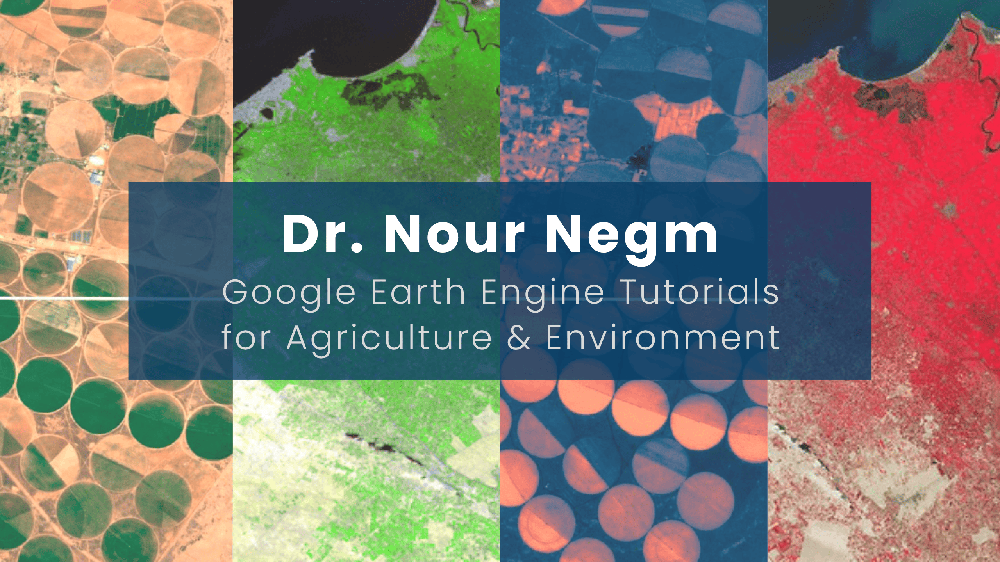

  

# 📡 Google Earth Engine Tutorials with Python
Welcome to the official repository for my YouTube tutorial series on using **Google Earth Engine (GEE)** with **Python** — focused on practical applications in **agriculture**, **environmental monitoring**, and **remote sensing**.

This project is part of my personal journey to learn and share hands-on techniques in Earth observation using GEE Python API.

---

## 📚 Tutorials & Notebooks

Each video in the series includes a Jupyter notebook that you can run using [Google Colab](https://colab.research.google.com/).

| Video | Topic | Notebook |
|-------|-------|----------|
| 01 | Your First Map in GEE with Python | [View Notebook](notebooks/01_Your_First_Map.ipynb) |
| 02 | Search, Visualize & Export Sentinel-2 Imagery | [View Notebook](notebooks/02_Search,_Visualize_&_Export_Sentinel_2_Imagery.ipynb) |
| 03 | Uploading and Using Shapefiles with Landsat 9  | [View Notebook](notebooks/03_Uploading_and_Using_Shapefile.ipynb)
| 04 | Compute NDVI with Cloud Masking from Sentinel-2 | [View Notebook](notebooks/04_Compute_NDVI_with_Cloud_Masking_from_Sentinel_2.ipynb)
| 05 | NDVI Time Series Analysis using XEE and Landsat 8 (2014–2024 | [View Notebook](notebooks/05_NDVI_Time_Series_Analysis_using__XEE_and_Landsat_8_(2014–2024).ipynb)
| 06 | Egypt Monthly Temperature Time Series & Annual Maps (2000–2024) | [View Notebook](notebooks/06_Egypt_Monthly_Temperature_Time_Series%20%26%20Annual_Maps_(2000-2024).ipynb)
| 07 | Sen’s Slope Analysis of Egypt Temperature Change (Last 25 Years) | [View Notebook](notebooks/07_Sen_Slope_Temperature_Trend_Egypt_(25_Years)_with_XEE.ipynb)
| 09 | NDVI Split Map Comparison (2003 vs 2023) using geemap  | [View Notebook](notebooks/09_NDVI_Split_Map_Comparison_(2003%20vs%202023)_using_geemap.ipynb)
| 10 | NDVI using Sentinel_2 and Landsat8 with_eemont | [View Notebook](notebooks/10_NDVI_using_Sentinel_2_and_Landsat8_with_eemont.ipynb)
| 11 | SAVI using Sentinel_2 and Landsat8 with_eemont | [View Notebook](
> 💡 New videos and notebooks will be added weekly!

---

🌍 These tutorials are focused on:
- Earth observation
- Agriculture and environment applications
- Satellite data, AOI processing
- Hands-on learning using Colab notebooks

🧪 Target audience: Arabic-speaking researchers, students, and professionals.

## ▶️ YouTube Channel

📺 [Dr. Nour Negm](https://www.youtube.com/@DrNourEarthEngine)  
👉 Subscribe for weekly Arabic-language tutorials

---

## 📬 Contact

💼 [LinkedIn](https://www.linkedin.com/in/nour-ibrahim)

💻 [GitHub](https://github.com/NourNegm85)

📬 Email: nourml2020@gmail.com

## 💬 License

All notebooks and resources are shared for **educational purposes**.  
Feel free to use and modify with credit to the author.
